<h2 align=center>Lecture II</h2>

<h1 align=center>Programming Fundamentals: Values, Types, and Variables</h1>

<h3 align=center>21 Fructidor, Year CCXXXIV</h3>

<p align=center><strong><em>Song of the day</strong>: <a href="https://youtu.be/jc5VCu0ECSI"><strong><u>Chloroform</u></strong></a> by Phoenix (2013)</em></p>

---

## Sections

1. [**Getting Organised**](#1)
2. [**Parts of a Program**](#2)
3. [**Values and Types**](#3)
4. [**Variables**](#4)
5. [**Program Input**](#5)

---

<a id="1"></a>

## Getting Organised

One of the most underrated strategies for succeeding in this course is staying organised; keeping your files in places where you can readily find them will help you more than I can express in writing—you really have to see it to believe it. Go ahead and create a folder structure that looks like this:

```
cs1114
 │
 ├── hw
 │   └── assignment_1
 ├── labs
 │   ├── 00
 │   └── 01
 ├── lectures
 │   ├── 00_introduction
 │   │   └── hello_world.py
 │   ├── 01_fundamentals1
 │   └── 02_fundamentals2
 └── others
```
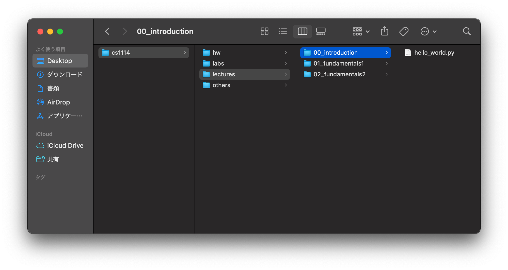

<sub>**Figures 1 and 2**: Your folder structure should look like this. You don't need to actually create the `hello_world.py` file yet. I just added it for illustration purposes.</sub>

You don't have to follow my naming convention (in fact, I use three different naming conventions above), but I strongly encourage you to find one that you like and stick to it. A couple of heuristics to follow when doing this are:

1. Do _not_ use spaces in the names of your folders and files. This will make more sense later in the semester, but spaces are poorly handled programmatically. If your file/folder name contains a space (` `), use underscores between words (i.e. `something_like_this`) or simply don't use spaces at all.
2. Try to pick a naming convention that can be _easily sorted_. That is, putting numbers at the beginning of your folder names will allow you to sort them by that specific number.

That taken care of, let's take a look at Thonny, a good starting point for Python IDEs.

<a id="2"></a>

## Parts of a Program

The moment you open Thonny up, you will be met with the following window:

<a id="fg-3"></a> 

<p align=center>
    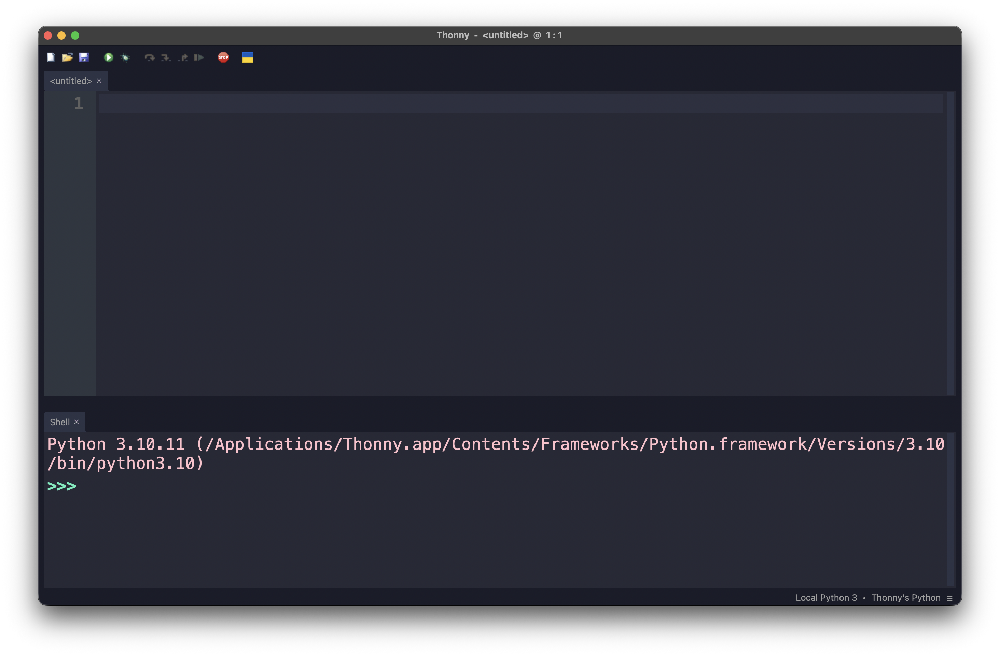
    </img>
</p>

<p align=center>
    <sub>
        <strong>Figure 3</strong>: The Thonny Workspace.
    </sub>
</p>

It's a very minimalist interface, and it works in its favour. You can probably already tell that it is roughly split into two parts, which I have labelled below as 1 and 2:

<a id="fg-4"></a> 

<p align=center>
    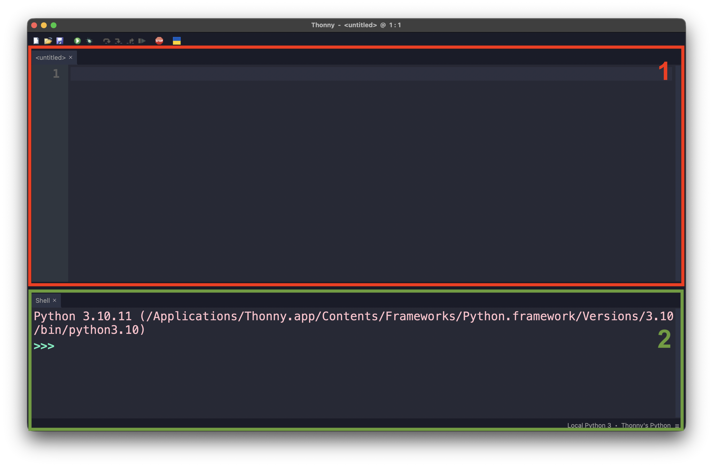
    </img>
</p>

<p align=center>
    <sub>
        <strong>Figure 4</strong>: The two main panels of Thonny's GUI.
    </sub>
</p>

In general, I would like for you to think of these two panels in the following way:

1. **The Developer Side**: This is the part that the user of your application would never see. It's where you, the programmer, write code that will make things happen in the _user side_.
2. **The User Side**: What the regular user of your application would see—a phone screen, a laptop screen, an ATM panel, etc.. Naturally, no code would ever appear here.

Now, if you want to run a quick line of code to test that everything is working, go ahead and copy the canonical first line of code for any programmer...

```python
print("Hello, World!")
```

...paste it onto the _developer side_ of Thonny's interface, and press the green play button on the top menu:

<a id="fg-5"></a> 

<p align=center>
    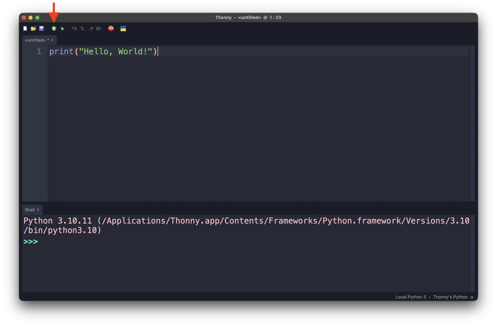
    </img>
</p>

<p align=center>
    <sub>
        <strong>Figure 5</strong>: One of the two ways of running a file in Thonny. The other is by pressing the <code>F5</code> key.
    </sub>
</p>

This should make the text `Hello, World!` appear in the _user side_ of things:

<a id="fg-6"></a> 

<p align=center>
    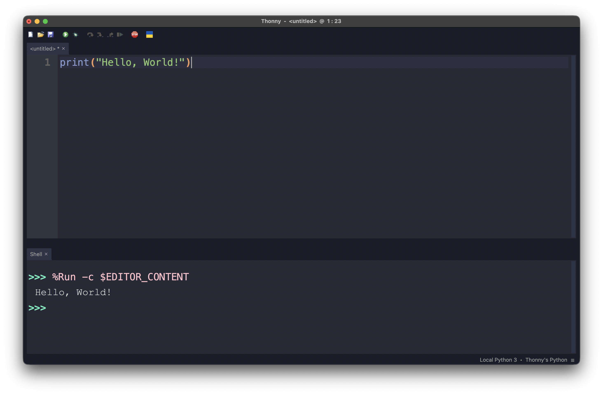
    </img>
</p>

<p align=center>
    <sub>
        <strong>Figure 6</strong>: Congrats, welcome to programming.
    </sub>
</p>

Now, if you notice, there's a small asterisk right next to the presently-unnamed tab we're working with. This means that our file is currently _unsaved_ and closing it will make you lose all of your progress:

<a id="fg-7"></a> 

<p align=center>
    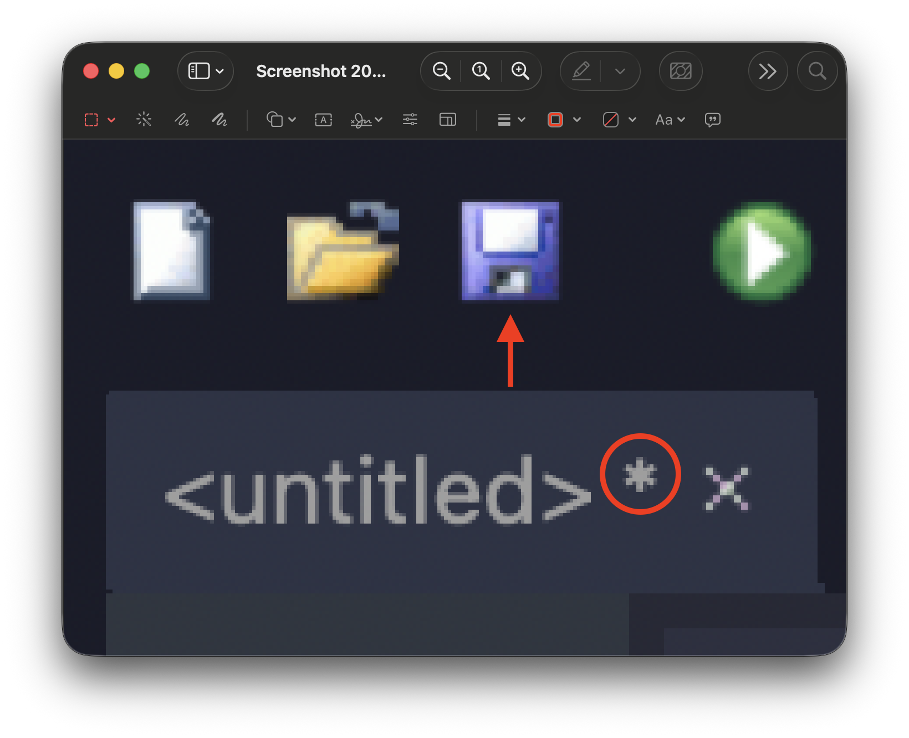
    </img>
</p>

<p align=center>
    <sub>
        <strong>Figure 7</strong>: Clicking on the floppy disk icon will prompt the file save dialogue window.
    </sub>
</p>

Thonny should, ideally, prompt you to save before you accidentally close an unsaved file, but just to be on the absolutely safe side, I recommend getting into the habit of saving by either clicking on the floppy disk icon (as shown in figure 7), or by spamming `COMMAND` + `S` if you're on Mac, `CONTROL` + `S` if you're on Windows.

Again, I'm kinda paranoid when it comes to saving (I come from a time where saving was the least guaranteed and automatic process in computers, video games—anything), but it doesn't hurt to get into the habit. Your future self will thank you.

<a id="3"></a>

## Values and Types

The very first thing we will learn about is quite literally the reason why computer science exists: data—things like our
ages, our grades, our names, etc..

The formal definition of a ***value*** is as follows:

> **Value (a.k.a. Objects)**: A number, string, or other kinds of data that can be stored in a variable or computed in
an expression.

There's a couple of words in that sentence that you might have not seen before, but we'll get to them in due time. Just
know that a value in Python is basically just a piece of data or information.

One quirk of Python is that ***all values are objects of a class***. You'll learn the specifics of objects and classes near the
end of the semester, but for now we can be introduced to the most basic object types/classes of the language:

| **Type/Class** | **Examples**                                                                 | **Description**                                                                                                                                                                    |
|----------|------------------------------------------------------------------------------|------------------------------------------------------------------------------------------------------------------------------------------------------------------------------------|
| `int`    | `1`, `42`, `-101`, `0`                                                       | A data type representing a **whole number (integer)** value, positive or negative                                                                                                  |
| `float`  | `3.1416`, `22.7`, `-4.0`, `1.0`                                              | A data type representing a **floating-point (decimal-valued)** number value,  positive or negative, and is only an approximation. Be careful using them in calculations.           |
| `str`    | `"Cardcaptor Sakura"`,  `'Viva la Revolución'`, `'''Comments'''`,  `"""""""` | A data type representing a **sequence of characters (string)** characters. Can be  enclosed using `'`, `"`, `'''` (or `"""`)                                                       |

<p align=center>
    <sub>
        <strong>Figure 8</strong>: Three of the most common types in Python.
    </sub>
</p>

The keywords `int`, `float`, and `str`, aside from representing these three types, also serve as **conversion (or coaxing)
functions**. In the _user_ side of Thonny, go ahead and type the following lines of code (not the `>>>`, just what follows after it):

```python
>>> int(4.5)
4

>>> float(7)
7.0

>>> str(1.2)
'1.2'

>>> int('42')
42

>>> float('Bankrupt!')
Traceback (most recent call last):
  File "<input>", line 1, in <module>
ValueError: could not convert string to float: 'Bankrupt!'
```

The process of converting values from one type to the other is often called **type casting**. So, above, in
order, reads as follows:

> The value of the float value `4.5` casted as an **integer** is `4`.
>
> The value of the integer value `7` casted as a **float** is `7.0`.
>
> The value of the float value `1.2` casted as a **string** is `'1.2'`.
>
> The value of the string value `"42"` casted as an **integer** is `42`.
>
> The value of the string value `"Bankrupt!"` casted as a float is an **invalid operation**.

As you can see, casting to either an integer or a float from a string requires your string to contain a numeric value,
and nothing else.

This is often a point of confusion for students. They will get, say, the string `"3.15"` as the answer for an operation.
However, if the rest of the program operates on `3.15` assuming that it is a float number, your program will very likely
crash. Being able to catch and recognise these errors takes some practice, but it is something you should be consciously
watching out for from the beginning.

Note, also, that it is not possible to cast a string that looks like a float directly into an integer. You'll first need to cast it into a float, and _then_ into an integer:

```python
>>> int("3.14")
Traceback (most recent call last):
  File "<stdin>", line 1, in <module>
ValueError: invalid literal for int() with base 10: '3.14'
```

<a id="4"></a>

## Variables

Okay, so we have a way of representing data in the form of types, but how do we store this data so that we can use it
in our programs? This is the job of ***variables***.

A good way of thinking of variables is as boxes that store our belongings when we are moving. Usually, we store things
in boxes to keep them safe and organised so that we can easily find and use them later on. Moreover, the best way to
know which box holds what is to label them—like putting a piece of tape with the contents written on it.

That's basically the exact same process we use in programming to ensure that our data is stored and easily accessible to
us.

For example, if we wanted to store the current year, we'd do something like this in Python:

```python
current_year = 2026
```

In this statement, `current_year` is the name of the variable, `=` is the **assignment operator**, and `2026` is the
value.

If I try doing this in Thonny, and then printing `current_year`, you'll see this:

<a id="fg-9"></a> 

<p align=center>
    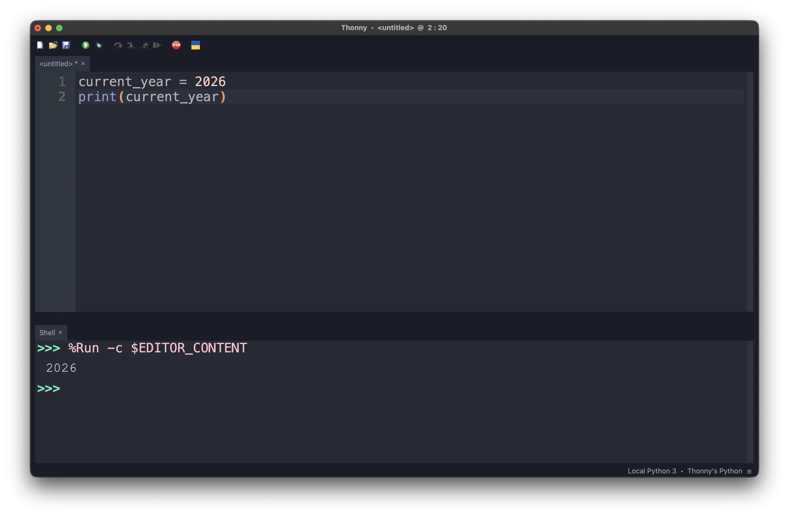
    </img>
</p>

<p align=center>
    <sub>
        <strong>Figure 9</strong>: Note that Thonny didn't show the user the name of the variable, only what is <em>contained</em> in it.
    </sub>
</p>

Now, I could have called this variable anything I wanted. As long as your variable names start with an alphabetic
character or an underscore (`_`), you are not restricted in any way:

<a id="fg-10"></a> 

<p align=center>
    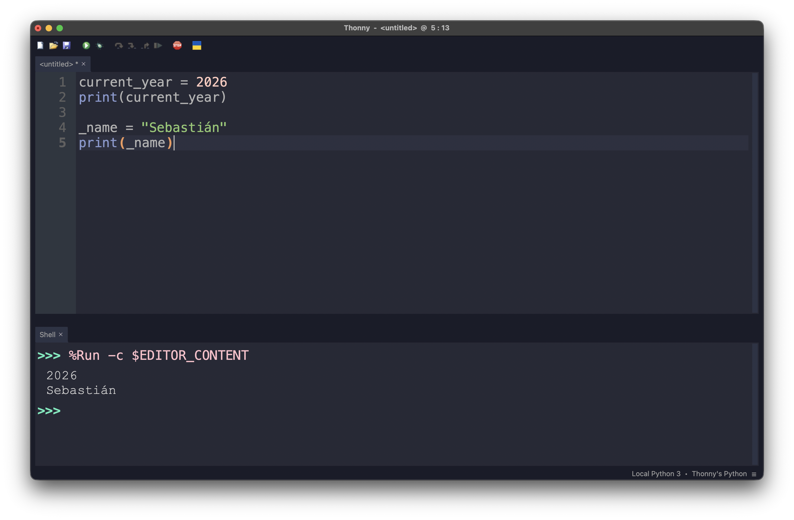
    </img>
</p>

<p align=center>
    <sub>
        <strong>Figure 10</strong>: Notice that code runs from <em>top to bottom</em>—always.
    </sub>
</p>

Technically speaking a variable represents a value stored in your computer's memory. When you create a variable, you are
basically telling your computer something like this:

> Hey, I want you to store an integer, `2026`, inside a memory address. I want you to call this memory address
> `current_year` so I know where I can find this value if I ever need it.

In memory, this might look like this

<p align=center>
    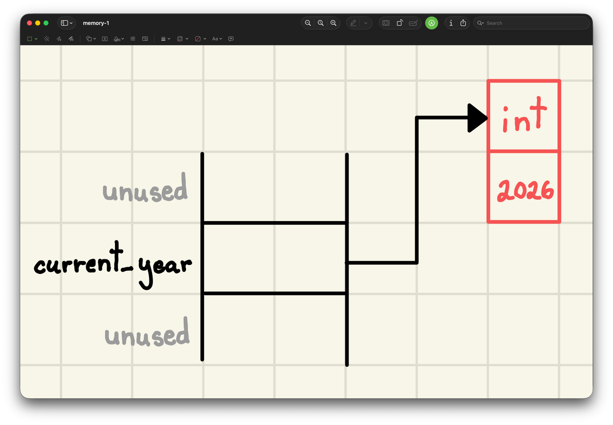
    </img>
</p>

<p align=center>
    <sub>
        <strong>Figure 11</strong>: The memory model of creating a variable called <code>current_year</code>, which is storing the integer value
        <code>2026</code>. The identifier <code>current_year</code> is only for <strong>you</strong> to be able to easily access this value. To your computer,
        though, this is just some random memory location).
    </sub>
</p>

A couple of technical terms that you should be aware of are **namespace** and **object space**. Simply put, the namespace
is where the names of your variables are stored, and the object space is where the values of your variables are stored.

So, more technically, we might say:

> The variable `current_year` is referencing an integer object, `2026`.

Now, say that time passes, and our app has to update to 2027. We could, of course, write another line of code to replace `2026` with `2027`:

```python
current_year = 2027
```

_Or_, we could simply replace `current_year` with it's current value _plus_ one:

```python
current_year = 2026

current_year = current_year + 1
```

We might read this as:

> We are adding the value stored inside of `current_year` to `1` (`2026 + 1`) and assigning the _result_ to `current_year`

Because `current_year` already had a value, we call this **reassignment**. The "old" value of `current_year` is "released" and we're only left with `2027`:

<p align=center>
    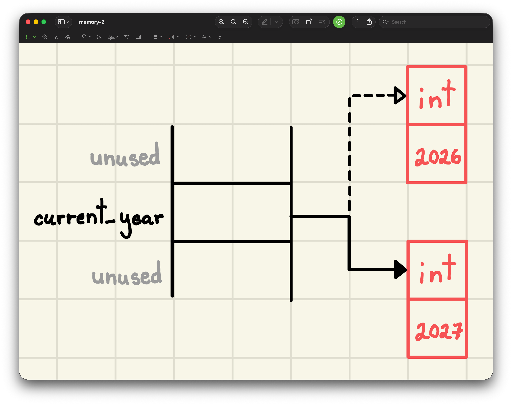
    </img>
</p>

<p align=center>
    <sub>
        <strong>Figure 12</strong>: The memory model of reassigning the variable <code>current_year</code>.
    </sub>
</p>

<br>

Now, of course, not all variable names are understood equally. Just like labels on boxes, giving your variables relevant,
explicative names is the way to go. In this class, in particular, make sure to follow these rules in order to not get
points taken off:

1. Make sure your variables have useful names (i.e. favor `acceleration_of_gravity = 9.81` over `aog = 9.81`).
2. Do not, and I repeat, do ***not*** give your variables single-letter variable names. This will always be penalised
   (with a single exception that we won't get into for a while).
3. Follow either snake-case (`sound_euphonium_2`), or camel-case (`soundEuphonium2`); this, of
course, means that variables are case-sensitive (i.e. `hello_world` and `HELLO_WORLD` are two different, completely
unrelated variable names).
4. They cannot be a Python keyword (`if`, `def`, `while`, etc.).

---

<a id="5"></a>

## Program Input

Earlier, we saw that we can display the values of variables and expressions by means of the `print()`
function:

```python
lecture_id = 8
print(lecture_id)

message = "オマエはもう死んでいる。"
print(message)

obvious_fact = 5 != "5"
print(obvious_fact)
```
Output:
```text
8
オマエはもう死んでいる。
True
```

That's a great thing to be able to do, and we'll be making ample use of this faculty. However, what kind of programs
would we realistically be writing if we weren't able to interact with our user? After all, almost every program that
is useful to us in some way gets our input; your phone registers your touch as an input, your laptop registers every
key stroke as an input, a camera registers light as input. Input, input, input.

It stands to reason, then, that this should be the next thing we need to focus on.

The most basic form of user interaction in Python is done through a very succinctly named built-in function—`input()`.

At its most basic level, it functions as follows:

```python
user_input = input()

print(user_input)
```

If we run this program, you will see that our shell window will pause, and wait for an action from us:

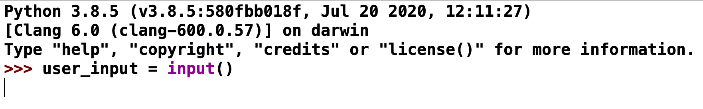

<sub>**Figure 13**: Our shell prompting us for input.</sub>

If we type something in—say, the course number for this class—and press "enter", you will see the following behavior:

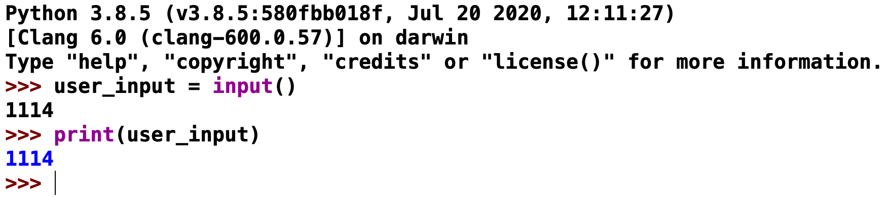

<sub>**Figure 14**: Our shell displaying our input.</sub>

This works just fine. But typically speaking, we want our programs to be as intuitive and user-friendly as possible—to
have good [**UI**](https://en.wikipedia.org/wiki/User_interface) and 
[**UX**](https://en.wikipedia.org/wiki/User_experience), in other words. The `input()` function allows us to give the 
user a "prompt" message by putting it, ***in string form***, inside the `input()` function's parentheses:

```python
course_number = input("What is this class's course number? ")

print(course_number)
```

If we ran this, our shell would prompt us the following way:

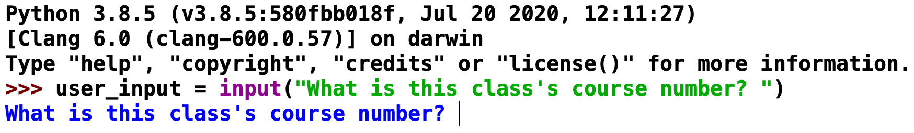

<sub>**Figure 15**: Our shell prompting us for this class's course number.</sub>

Once we enter our desired input and press the "enter" key, we will see the following:

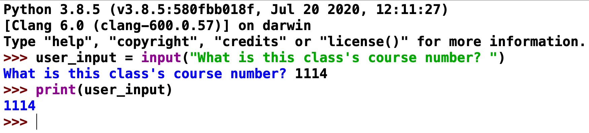

<sub>**Figure 16**: Our shell displaying this class's course number.</sub>

These two programs, effectively, do the same exact thing (i.e. accepting user input and displaying), but in the first
one, we are barely even aware that we're being prompted for input—and we have no idea what input is supposed to even
_be_. The second example, by contrast, at the very least gives us a clear idea of the type and nature of our input.
It won't stop any user from entering the wrong thing, but at least we can say that we gave them some hints.

Now, interestingly, **Python saves all input in `str` form**, meaning that our input of "1114" is not saved as an 
integer, as one might expect, but as a string. Sure enough, if we run the same code on our console, we can very clearly
see that the variable `course_number` is a `str` object:

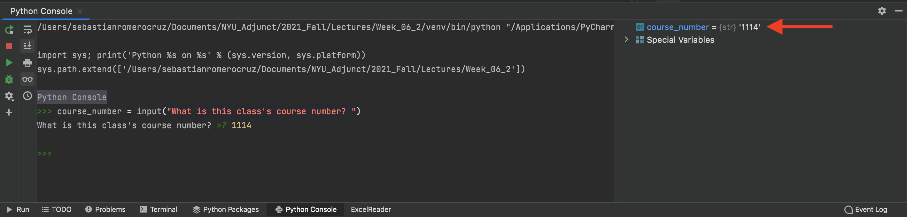

<sub>**Figure 17**: PyCharm's console displaying the type of `course_number` on the right.</sub>

There is essentially no way of changing this behavior. Python, by design, received all input in string form. It's up to
us, the programmers, to parse that input into a usable form.

---

<sub>**Previous: [Introduction](/lectures/01-introduction)** || **Next: [Programming Fundamentals 2](/lectures/03-programming-fundamentals-2)**</sub>
