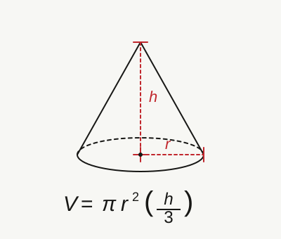

<h2 align=center>Lecture III</h2>

<h1 align=center>Programming Fundamentals: Operators, Expressions, and Program Output</h1>

<h3 align=center>28 de Fructidor, de l'Année CCXXXIV de la République</h3>

<p align=center><strong><em>Song of the day</strong>: <a href="https://youtu.be/USNIttGEGVw"><strong><u>Novembre</u></strong></a> by Adèle Castillon (2023)</em></p>

---

## Sections

1. [**Expressions**](#1)
2. [**Boolean Expressions**](#2)
    1. [**Comparison Operators**](#2-1)
    2. [**The `not` Operator**](#2-2)
    3. [**The `and` Operator**](#2-3)
    4. [**The `or` Operator**](#2-4)
3. [**Program Output**](#3)

---

<a id="1"></a>

## Expressions

So, last time, we left off with the idea that we can store a piece of data (e.g. a number, a word, etc.) inside Python
using variables. This allows us to keep that information safe and organized so that we can use it in our programs later.

For example, let's say we wanted to calculate the volume of a cone with a base radius of 7 and a height of 4.5. **How
would you define these variables in Python?**

Perhaps something like this:

```python
pi = 3.14156
base_radius = 7
height = 4.5
```

In order, these three variables read in English as:

- A variable called `pi` with the `float` (floating-point) value of `3.14156`
- A variable called `base_radius` with the `int` (integer) value of `7`
- A variable called `height` with the `float` value of `4.5`.

Note again that the `=` does **not** represent equality, but rather is the **assignment operator**.

This is all well and good, but the formula for the volume of a cone is as follows:

<a id="fg-1"></a>

<p align=center>
    
    </img>
</p>

<p align=center>
    <sub>
        <strong>Figure 1</strong>: Formula for the volume of a cone, <code>V</code>, of base radius <code>r</code> and height <code>h</code>.
    </sub>
</p>

Clearly, there's more to calculating the volume than just defining three variables. We need to actually operate on them.
For this, in programming, we construct what is called an ***expression***.

> **Expression**: a combination of operators and operands (variables and values) that, when evaluated, results in a 
> single value.

We saw last time that Python can do simple mathematical operations—namely, add:

```python
>>> current_year = 2026
>>> university_years = 4 # ideally
>>> current_year + university_years
2030
```

In this case, `current_year` and `university_years` are the **operands** of the expression, and `+` is the **operator**
of the expression (the "plus" or "addition" operator).

> **Operator**: a symbol that performs a simple computation on, or between, operands.

> **Operand**: a value on which an operator acts.

The great thing about expressions that we can save their result, whatever that result may be, inside a variable:

```python
>>> current_year = 2026
>>> university_years = 4
>>> graduation_year = current_year + university_years
```

Now, the variable `graduation_year` is **storing the value of the result of applying the `+` operator on the operands 
`current_year` and `university_years`**.

We could have simply said that `graduation_year` is "equal to `current_year` plus `university_years`", but thinking in
terms of operators and operands helps us account for the possibility of our operands _not_ being numbers. (i.e. what
happens if you add two strings together?)

---

So, how can we apply this same process to our earlier problem of calculating the volume of a cone?

```python
pi = 3.14156
base_radius = 7
height = 4.5

volume_of_cone = pi * (base_radius * base_radius) * (height / 2)  # evaluates to 346.35699
```

<sub>**Code Block 1**: Calculating the volume of a cone and storing it in the variable `volume_of_cone`.</sub>

The variable `volume_of_cone` is now holding the value of an **expression**. The difference between this and a simple
value is that the value of an expression is dependent on the values of its contents. In code block 1, `volume_of_cone`
happens to evaluate to `346.35699`, but if I changed the values of `pi`, `base_radius`, and/or `height`, the value of
`volume_of_cone` would also change:

```python
pi = 3.14156
base_radius = 20
height = 5.5

volume_of_cone = pi * (base_radius * base_radius) * (height / 2)  # evaluates this time to 3455.716
```

In this expression, `pi`, `base_radius`, and `height` are the ***operands***; `*` and `/` are the ***operators***.

Here's a table of the arithmetic operators available to us in Python:

| **Operator** | **Description**  | **Example**                                                                                              | **Notes**                                                                                                                                                                                            |
|--------------|------------------|----------------------------------------------------------------------------------------------------------|------------------------------------------------------------------------------------------------------------------------------------------------------------------------------------------------------|
| `+`          | Addition         | `2.5 + 3` (evaluates to float value `5.5`)                                                               |                                                                                                                                                                                                      |
| `-`          | Subtraction      | `42 - 6.7` (evaluates to float value `35.3`)                                                             |                                                                                                                                                                                                      |
| `*`          | Multiplication   | `0.15 * 0.045` (evaluates to float value `0.00675`)                                                      |                                                                                                                                                                                                      |
| `**`         | Exponentiation   | `25 ** 0.5` (equivalent to saying "25 to the power of 0.5; evaluates to float value `5.0`)               |                                                                                                                                                                                                      |
| `/`          | Division         | `10 / 150` (evaluates to float value `0.06666666666666667` in my computer; exact approximation may vary) | Also known as floating-point division                                                                                                                                                                |
| `//`         | Integer Division | `93.4323 // 5` (evaluates to float value `18.0`)                                                         | Evaluates to whole number resulting from removing decimal component of floating-point division result; while integer division will always result in a whole number, the type will still be a `float` |
| `%`          | Modulus          | `63 % 10` evaluates to integer value `3`; 63 divides 6 even times into 10, leaving a remainder of 3      | Evaluates to the remainder from dividing two integers; returns an `int` value                                                                                                                        |

<p align=center>
    <sub>
        <strong>Figure 2</strong>: Python's arithmetic operators.
    </sub>
</p>

The precedence of these operators is basically the same as the mathematical acronym P.E.M.D.A.S., except we could 
expand it to include negation (negative numbers) : P.E.N.M.D.A.S. (very catchy):

1. Parentheses `()`
2. Exponentiation `**`
3. Negation `-`
4. Multiplication `*`, Division `/`, Floor Division `//`, Modulo `%`
5. Addition `+`, Subtraction `-`

For example:

```python
>>> 5 * 3 + 2 * 7
29

>>> 5 * (3 + 2) * 7
175

>>> 7 % 3 * -5
-5

>>> 98 // 10 + 2 % 7
11
```

<a id="2"></a>

## Boolean Expressions

We're pretty well acquainted with how boolean expressions function at this point. They either evaluate to `True` or they
evaluate to `False`. What we haven't covered yet are their respective operators—`not`, `and`, and `or`—which is exactly
what the rest of this section is for. Given our newfound knowledge of variables, we can expand our current definition
to something a little more nuanced:

> **Boolean expression**: Code that evaluates to a combination of operators and operands that, when evaluated, results 
> in `True` or `False`.

<a id="2-1"></a>

### Comparison Operators

Moreover, just like in mathematics, we have the ability to compare two values to figure out their equality. These are 
called ***comparison, or relational, operators***:

| **Operator** | **Verbal Equivalent**                         | **Example**                                           |
|--------------|-----------------------------------------------|-------------------------------------------------------|
| `==`         | _"Is A equal in value to B?"_                 | `45 == 45.0` (evaluates to bool value `True`)         |
| `!=`         | _"Is A not equal in value to B?"_             | `10 != 10.0` (evaluates to bool value `False`)        |
| `>`          | _"Is A greater in value than B?"_             | `0.15 > 0.045` (evaluates to bool value `True`)       |
| `>=`         | _"Is A greater than or equal in value to B?"_ | `25 >= 25` (evaluates to bool value `True`)           |
| `<`          | _"Is A less in value than B?"_                | `10 < 150` (evaluates to bool value `True`)           |
| `<=`         | _"Is A less than or equal in value to B?"_    | `93.4323 <= 93.4324` (evaluates to bool value `True`) |

<p align=center>
    <sub>
        <strong>Figure 3</strong>: Comparison (relational) operators in Python, where both A and B are comparable values.
    </sub>
</p>

> **Comparable value**: Values that can be compared using a boolean operator. (E.g. `4` and `7.6` are comparable values,
> but `"lol I'm so tired."` and `True` aren't.)

<a id="2-2"></a>

### The `not` Operator

We can represent the effects of the `not` operator by using a _truth table_:

| **`a`**   | **`not a`** | **Description**                                                    |
|-----------|--------------|-------------------------------------------------------------------|
| `True`    | `False`      | If **`a`** evaluates to `True`, **`not a`** evaluates to `False`  |
| `False`   | `True`       | If **`a`** evaluates to `False`, **`not a`** evaluates to `True`  |

<p align=center>
    <sub>
        <strong>Figure 4</strong>: Truth table for the <code>not</code> operator, where <code>a</code> is any given boolean expression.
    </sub>
</p>

To give linguistically relatable examples:

- "The year is 2026" evaluates to `True`
- `not` "NYU is in New York" evaluates to `False`

`not` is a pretty nice operator because it only involves the use of only one boolean expression (the technical term for
this is a unary boolean operator).

<a id="2-3"></a>

### The `and` Operator

Oftentimes, though, we need multiple conditions to be true in order for something to execute. For instance, a building 
screener might allow you in by applying the following logic:

> ***If*** this student has a valid ID ***and*** is on the building's access list, they can go into any NYU 
> building.

In this case, we have **two** conditions that need to be true for a certain action to get executed. The operator used 
here would be the word "and". Conveniently, that corresponds exactly to Python's `and` operator:

| **a**   | **b**   | **a and b** | **Description**                                                                                      |
|---------|---------|-------------|------------------------------------------------------------------------------------------------------|
| `True`  | `True`  | `True`      | If **a** evaluates to `True` and **b** evaluates to `True`, then **a and b** evaluates to `True`     |
| `True`  | `False` | `False`     | If **a** evaluates to `True`, and **b** evaluates to `False`, then **a and b** evaluates to `False`  |
| `False` | `True`  | `False`     | If **a** evaluates to `False`, and **b** evaluates to `True`, then **a and b** evaluates to `False`  |
| `False` | `False` | `False`     | If **a** evaluates to `False`, and **b** evaluates to `False`, then **a and b** evaluates to `False` |

<p align=center>
    <sub>
        <strong>Figure 5</strong>: Truth table for the <code>and</code> operator, where <code>a</code> and <code>b</code> are any given boolean expressions.
    </sub>
</p>

Let's look at some non-programming examples:

- "The year is 2026 and NYU is in New York" evaluates to `True`
- "The year is 2018 and NYU is in New York" evaluates to `False`
- "The year is 2026 and `not` NYU is in New York" evaluates to `False`
- "The year is 2018 and NYU is in the city of York" evaluates to `False`

By the way, since `and` requires two boolean expressions to operate, it is sometimes called a _binary_ boolean operator. 

<a id="2-4"></a>

### The `or` Operator

Another situation one often encounters in programming is when an instruction gets executed if either of two conditions
evaluates to true. For example, in order to attend the [**Met Gala**](https://en.wikipedia.org/wiki/Met_Gala), you 
either need to get a special invitation, or donate $30,000.00 to the museum, in order to secure your seat. This is 
different from the `and` operator because `and` requires **both** conditions to be true. In this case (as you've 
probably guessed by now) we would instead use the `or` operator.

| **a**   | **b**   | **a or b** | **Description**                                                                                       |
|---------|---------|------------|-------------------------------------------------------------------------------------------------------|
| `True`  | `True`  | `True`     | If either **a** evaluates to `True` or **b** evaluates to `True`, then **a or b** evaluates to `True` |
| `True`  | `False` | `True`     | If **a** evaluates to `True` or **b** evaluates to `False`, then **a or b** evaluates to `True`       |
| `False` | `True`  | `True`     | If **a** evaluates to `False` or **b** evaluates to `True`, then **a or b** evaluates to `True`       |
| `False` | `False` | `False`    | If **a** evaluates to `False` or **b** evaluates to `False`, then **a or b** evaluates to `False`     |

<p align=center>
    <sub>
        <strong>Figure 6</strong>: Truth table for the <code>or</code> operator, where <code>a</code> and <code>b</code> are any given boolean expressions.
    </sub>
</p>

This one is a little more difficult to think about, so let's look at some examples:

- "The year is 2026 or NYU is in New York" evaluates to `True`
- "The year is 2018 or NYU is in New York" evaluates to `True`
- "The year is 2026 or `not` NYU is in New York" evaluates to `True`
- "The year is 2018 or NYU is in the city of York" evaluates to `False`
- "You didn't get a special invitation to the Met Gala, or you didn't donate $30,000.00 to the Met's Anna Wintour 
Costume Center" evaluates to `False`

Essentially, the only way that the whole boolean expression can evaluate to `False` is for both of its components to be
`False`.

---

These operators also have a place in our precedence hierarchy, which is now too long to even try to make an acronym:

1. Parentheses `()`
2. Exponentiation `**`
3. Negation `-`
4. Multiplication `*`, Division `/`, Floor Division `//`, Modulo `%`
5. Addition `+`
6. Subtraction `-`
7. Comparison operators (`==`, `!=`, `<=`, `>=`, `>`, `<`)
8. Not `not`
9. And `and`
10. Or `or`

For example:

```python
>>> 10 + 3 < 25 and 7 - 2 > 4
True

>>> not 10 + 5 < 7 and 5 == 4 or 7 * 3 != 5
True
```

If we break down that second one, step-by-step and following the precedence rules, it simplifies as follows:

```python
# multiplication and addition have the highest precedence, so it goes first
>>> not 10 + 5 < 7 and 5 == 4 or 7 * 3 != 5
True

# <, ==, and != have the 2nd highest precedence
>>> not 15 < 7 and 5 == 4 or 21 != 5
True

# "not" has the 3rd highest precedence
>>> not False and False or True
True

# "and" has the 4th highest precedence
>>> True and False or True
True

# "or" has the 5th and lowest precedence, so it goes last
>>> False or True
True
```

As you can see, as long as we follow these rules, we can slowly and carefully evaluate any expression, regardless of
how long and complex it may be.

<a id="3"></a>

## Program Output

Recall our program for calculating the volume of a cone:

```python
pi = 3.14156
base_radius = 7
height = 4.5

volume_of_cone = pi * (base_radius * base_radius) * (height / 2)  # evaluates to 346.35699
```

In order to let you know that the result of this operation was `346.35699`, I had to write a comment saying so next
to the line declaring the value of `volume_of_cone`. It probably goes without saying that this is not an effective way
of _displaying_ the results of programming outputs. The code used in your phone's calculator or called ID screen most
definitely has comments scattered through it, but you have and will never see them. Instead, your phone has ***output***
protocols that display the relevant information to the user on the screen. This same principle goes for music. Audio
output is processed by signal processing programs so that it comes out as music. How would comments even begin to help 
us in this case?

We're a few ways away from worrying about those kinds of things, but for the time being, we should learn at least the
most rudimentary way of displaying data in our programs. For this, we use the built-in Python function **`print()`**:

Open up the file [**volume_of_cone.py**](volume_of_cone.py). Our program looks like this:

```python
# Defining our variables for volume of a cone
pi = 3.1456
base_radius = 7
height = 4.5

# Not really necessary here, but splitting an expression into parts often helps
# us debug easier
constants = pi / 3
print("Constants:")
print(constants)

radius_component = base_radius * base_radius
print("Radius Component:")
print(radius_component)

height_component = height
print("Height Component:")
print(height_component)

# Calculation
volume = constants * radius_component * height_component

# Output
print(volume)
```
<sub>**Code Block 2**: Contents of [**volume_of_cone.py**](volume_of_cone.py).</sub>

When we press "run", our Terminal window appears and should look something like this:

```text
Constants:
1.0485333333333333
Radius Component:
49
Height Component:
4.5
231.20159999999998
```

Notice that we didn't need a single comment to figure out what was going on—each `print()` call told us exactly what
was being computed at every step, right there in the Terminal. This is how we're going to check and display the values
of the expressions that we will be using throughout this class.

The `print()` function is actually extremely versatile and powerful. More on that later, but for now, burn the following
absolute fact into your brain:

> ***`print()` statements are your best friends. Use them.***

---

<sub>**Previous: [Programming Fundamentals 1](/lectures/02-programming-fundamentals-1)** || **Next: [Number Systems and Python Modules](/lectures/04-number-systems-and-python-modules)**</sub>
