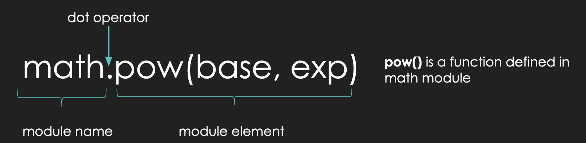
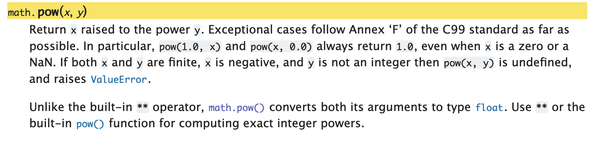

<h2 align=center>Lecture IV</h2>

<h1 align=center>Python Modules: <code>math</code> and <code>random</code></h1>

<h3 align=center>30 de Fructidor, de l'Année CCXXXIV de la République</h3>

***Song of the day***: _[**Surfin' Boy (Flamingosis Remix)**](https://youtu.be/tbxXSIBL8S4) by Red Velvet (2026)._

### Sections:

0. [**Constants**](#part-0-constants)
1. [**The `math` Module**](#part-1-the-math-module)
2. [**The `random` Module**](#part-2-the-random-module)

### Part 0: _Constants_

So far, we've only ever used variables the way their name suggests: as things that *vary*. We define them, we
reassign them, we watch their values change as our program runs. But every so often, we want to define a value that,
semantically, should never change once we've set it—think of things like the number of days in a week, or the speed
of light, or the value of pi.

We call these ***constants***.

> **Constant**: A variable whose value is not meant to change over the course of a program's execution.

Python, unlike some other programming languages, doesn't actually have a built-in way of *enforcing* this. There's no
special keyword that will throw an error if you try to reassign one. Instead, we rely on ***convention***: constants
are conventionally named using **ALL CAPS**, with underscores separating words, like so:

```python
DAYS_IN_A_WEEK = 7
SPEED_OF_LIGHT = 299792458  # meters per second, approximately
```

Nothing is technically stopping you from writing `DAYS_IN_A_WEEK = 8` somewhere later in your program—Python won't
complain. But doing so would be a huge red flag to any programmer reading your code (including future you!) that
something has gone very wrong. In other words, all-caps naming is a signal to other programmers, not a lock.

Why bring this up now? Because, as you're about to see, Python ships with entire modules full of extremely precise,
pre-defined constants—so that you never have to define (and, worse, approximate) commonly used values like pi
yourself ever again.

### Part 1: _The `math` Module_

You know how, in a previous lecture, I asked you to calculate the volume of a cone? For many mathematical operations, we
need to use certain constants—like the ones we just talked about—such as **pi**. In our case, I asked you to define a
variable that would hold your best estimation of this value:

```python
pi = 3.14156  # for example
```

It might not come as too much of a surprise that approximating such common and important constants is very bad practice.
This is especially the case because programming is often used in engineering applications where precision is of
paramount importance. In other words, you are not going to tell your boss at NASA that you programmed a rover by "sort
of guessing the value of pi." The great thing is that you really don't have to at all!

One of the great things about Python is that it has a ***huge*** community that constantly releases their code to the 
public—free of charge—for us to use. When we want to make use of this code, we have to import it in the form of a 
***module***.

---

One of the most common modules is the `math` module which, as you can probably guess, contains a plethora of math 
related functions and values that we can use:

```python
import math

pi = math.pi
e = math.e

print(pi)
print(e)
print(math.sin(pi))  # prints the sine of pi
print(math.sqrt(e))  # prints the square-root of e
print((math.pow(pi, e)))  # prints pi ** e
print(math.radians(pi))  # prints the radian equivalent of pi degrees
print(math.floor(e))  # rounds e up
print(math.ceil(e))  # rounds e down
```

Output:

```text
3.141592653589793
2.718281828459045
1.2246467991473532e-16
1.6487212707001282
22.45915771836104
0.05483113556160755
2
3
```

As you can see, we need to explicitly import the module for Python to be able to use it (`import math`). You'll also
notice that `math.pi` and `math.e` aren't written in `ALL_CAPS`—that's simply a naming choice made by the people who
wrote the `math` module, not a rule you need to follow yourself. They're still constants in every sense that matters:
their values never change, no matter how many times you use them. Note the format of module function calls:

<a id="fg-1"></a>

<p align=center>
    
    </img>
</p>

<p align=center>
    <sub>
        <strong>Figure 1</strong>: The format of a function call from the <code>math</code> module.
    </sub>
</p>

So, if we were to calculate the volume of our cone again—properly this time—I would now do something like 
[**this**](volume_of_cone.py):

```python
import math

base_radius = float(input("Please enter the length of the cone base radius: "))
cone_height = float(input("Please enter the length of the cone height: "))

constants = math.pi / 3
variables = math.pow(base_radius, 2) * cone_height  # the use of math.pow() is not strictly necessary, but I'm proving a point

volume = constants * variables

print("The volume of this cone is " + str(volume) + ".")
```
<sub>**Code Block 1**: A better [**solution**](volume_of_cone.py) for our cone volume problem.</sub>

Notice here that, when I used `math.pi`, I did not follow it with a set of parentheses `()`. This is because **`pi` is
not a function** (like `print()`, `input()`, etc.), but rather a simple value. On the other hand, we can see that the
`math.pow()` function call makes use of parentheses. This is because all Python function calls require the use of 
parentheses. We will learn more about the specifics of functions after the first midterm, but for now, you can safely 
assume that this is always the case.

According to the `math` module documentation, inside `math.pow()`'s parentheses, you must put the value of the base that
you want to raise, and the power to which you want to raise it, in that order:

<a id="fg-2"></a>

<p align=center>
    
    </img>
</p>

<p align=center>
    <sub>
        <strong>Figure 2</strong>: <code>math.pow()</code>'s documentation, explaining its use and its difference from the built-in <code>**</code> operator.
    </sub>
</p>

Here's the entire [**documentation**](https://docs.python.org/3/library/math.html) for the `math` module for your 
reference.

### Part 2: _The `random` Module_

Another very common module is the `random` module. It basically is what it sounds like: a library of functions that deal with
(pseudo-)random behavior.

The most basic of these is the `random()` function, which always returns a pseudo-randomly generated decimal `float` 
value:

```python
import random

random_decimal = random.random()
print(random_decimal)

random_decimal = random.random()
print(random_decimal)

random_decimal = random.random()
print(random_decimal)

random_decimal = random.random()
print(random_decimal)
```

A possible output:

```text
0.6549562234417277
0.8773055016457298
0.6249540159645146
0.5591596841328375
```

How would this be useful? The most basic example I can think of is a [**coin-flip program**](coin_flip.py), where `1` is
heads and `0` is tails:

```python
import random

random_decimal = random.random()
result = round(random_decimal)

print("The result of this coin flip is: " + str(result))
```

<sub>**Code Block 2**: [**Coin flipping**](coin_flip.py) with the `random` module.</sub>

A possible output—it has roughly a 50-50 chance of being either a `1` or a `0`:

```text
1
```

<sub>**Note**: The `round()` function simply rounds a number to its closest integer value.</sub>

If you would like to instead generate random integers, we could make use of the `randrange()` function:

```python
import random

lowest_possible = 1
upper_limit = 10

random_integer = random.randrange(lowest_possible, upper_limit)

print(random_integer)
```

<sub>**Code Block 3**: [**Generating**](random_integers.py) random integers.</sub>

A possible output:

```text
8
```

The `randrange()` function takes two arguments (i.e. values inside the parentheses). The first value represents the 
lowest possible integer that can be returned. The second value marks the upper limit—this means all possible numbers
***below*** this value are possible. In other words, the upper limit is **non-inclusive**. This being the case, our code
above can produce any integer value between 1 and 9.

If this "limitation" sounds weird to you, don't worry—it _is_ weird. In fact, there's actually another function in the
`random` module, `randint()`, where both values are inclusive. The reasons for `randrange()` will become obvious a bit
later in the semester, but when it comes to this module, feel free to use [either or both](random_integers.py) unless 
instructed otherwise:

```python
import random

lower_limit = 1
upper_limit = 10

random_integer_a = random.randrange(lower_limit, upper_limit)
random_integer_b = random.randint(lower_limit, upper_limit)

print("A random number from", lower_limit, "(inclusive) and", upper_limit, "(exclusive):", random_integer_a)
print("A random number from", lower_limit, "(inclusive) and", upper_limit, "(inclusive):", random_integer_b)
```

Possible output:

```text
A random number from 1 (inclusive) and 10 (exclusive): 3
A random number from 1 (inclusive) and 10 (inclusive): 10
```

For now, these are the functions from the `random()` module that you will be using the most, but we will be getting into
others later in the semester.

Here's the `random` module's [**documentation**](https://docs.python.org/3/library/random.html) for your reference.

---

<sub>**Previous: [Programming Fundamentals 2](/lectures/03-programming-fundamentals-2)** || **Next: [Selection Statements: `if`, `elif`, `else`, and Common Mistakes](/lectures/05-selection-statements)**</sub>
