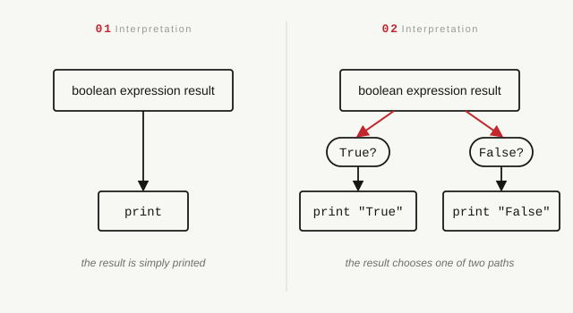
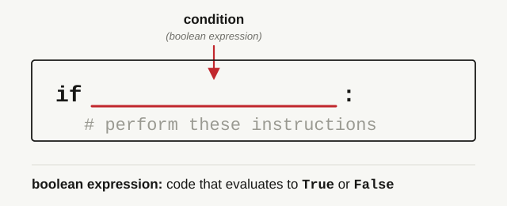

<h2 align=center>Lecture V</h2>

<h1 align=center>Selection Statements: <code>if</code> and <code>else</code></h1>

<h3 align=center>Jour des Récompenses, de l'Année CCXXXIV de la République</h3>

***Song of the day***: _[**Take a Chance**](https://www.youtube.com/watch?v=jJVe_6N8cLY) by DOMi & JD Beck, Anderson .Paak (2022)._

### Sections:

0. [**Module Practice**](#part-0-module-practice)
1. [**`if`-Statements**](#part-1-if-statements)
2. [**`else`-Statements**](#part-2-else-statements)

### Part 0: _Module Practice_

Ask the user to input two numbers (you can assume that they will always enter numerical characters). Then, write a program that will generate a random integer between `0` and `100`, inclusive on both ends. Finally, your program should print the boolean value `True` if:

- Both numbers fall between `0` and the random number (inclusive on both ends), or if...
- The value of the first number divided by the second number falls between `0` and the random number (inclusive on both ends).

Otherwise, your program should print the boolean value `False`. If you know what they are, you may _not_ use selection statements (`if`, `elif`, `else`).

The solution is fairly straightforward if you're comfortable with _conditional statements_. Getting the input and the random number shouldn't be too bad:

```python
import random

number_one = float(input("Enter a number: "))
number_two = float(input("Enter another number: "))

# a random number between and including 0 and 100
random_number = random.randrange(0, 101)
```

As for printing `True` or `False`, remember that _all conditional expressions evaluate to either `True` or `False`_. For example, `print(3 < 4)` outputs `True`. Our solution is exactly the same idea, just with a longer expression:

```python
print(0 <= number_one <= random_number and 0 <= number_two <= random_number or 0 <= number_one / number_two <= random_number)
```

Here, the computer is simply printing the value of a boolean expression, the same way it prints `5` after evaluating `print(3 + 2)`. No choices are being made. Why does this matter? Because a lot of students (perhaps you) read the problem this way:

> **If** both numbers lie in the range [0, random number], _or_ **if** the ratio of both numbers lies within the range [0, random number], then print the word `"True"`. If not, print the word `"False"`.

Very similar, but with a subtle, important difference: now **the computer is choosing between printing `True` and printing `False`** depending on the result of the expression:

<a id="fg-1"></a>

<p align=center>
    
    </img>
</p>

<p align=center>
    <sub>
        <strong>Figure 1</strong>: Two ways of looking at the instructions. In interpretation 1, the result of a boolean expression is being printed. In interpretation 2, the boolean expression is evaluated and, depending on the result, the computer will print either of the two words (True or False).
    </sub>
</p>

That ability—doing different things depending on whether something is true—is what makes programming languages more powerful than fancy calculators. (It's, in fact, the thing that makes a computer [**Turing complete**](https://en.wikipedia.org/wiki/Turing_completeness); if you want to know what that means, watch [**this**](https://youtu.be/AqNDk_UJW4k).) It's how your email knows to let you in, how your bank blocks suspicious activity, and how a self-driving car decides to change lanes.

So, what if we wanted our program to display a personalised message depending on whether the condition is true and, if it isn't, tell us why?

```
Enter a number: 42
Enter another number: 77
The ratio is between 0 and 25 so the expression evaluates to true.
```

Let's learn how to do this.

### Part 1: _`if`-Statements_

The first of these selection statements is the mother of all computer science structures—the `if` statement. Here's the
basic Python syntax:

<a id="fg-2"></a>

<p align=center>
    
    </img>
</p>

<p align=center>
    <sub>
        <strong>Figure 2</strong>: The syntax of an <code>if</code>-statement: a condition (any boolean expression) followed by the instructions to perform if it evaluates to <code>True</code>.
    </sub>
</p>

If we wanted to say this in plain English, it would just simply say:

> **If** a certain condition is **true**, perform these instructions **once**.

For example, let's say that we were programming a building's front-desk screening system, and a user can only enter the
building if they have a valid ID **and** if they are on the building's access list:

```python
id_status_input = input("Is this person's ID valid? [y/n] ")
access_status_input = input("Is this person on the building's access list? [y/n] ")

has_valid_id = id_status_input == 'y'
is_on_access_list = access_status_input == 'y'

if has_valid_id and is_on_access_list:
    # Indented statements only execute if both conditions are true
    print("This person is allowed in the building.")
```

This would read as:

> **If** this person has a valid ID **and if** this person is on the access list, then print the following message:
> 
> `"This person is allowed in the building."`

Notice that I don't say here `"if they have a valid ID and are on the access list"`. This is because Python considers each
clause **completely independent** of others. For example, imagine that a certain instruction would only be executed if
the user input was either `'y'` or `'Y'`. This would have to be written in Python as such:

```python
user_input = input("Would you like to continue? [y/n] ")

if user_input == 'y' or user_input == 'Y':
    # Do something
```

You should ***not*** type it this way, in other words:

```python
user_input = input("Would you like to continue? [y/n] ")

if user_input == 'y' or 'Y':
    # Do something
```

Why? Because Python would read that line as:

> If the value of `user_input` is equal to `'y'`, **or** `'Y'` (on its own) counts as `True`, then execute.

And this is clearly not what we're trying to say. So you have to be careful when writing your conditions; just because 
something reads a certain way in English, it does not necessarily mean that it translates exactly into Python.

### Part 2: _`else`-Statements_

So now we know how to have an instruction, or a set of instructions, execute whenever a condition (or set of conditions) is 
true. So what happens in the case where we want a specific set of instructions to execute when a condition evaluates to 
false? Let's say a certain American alcohol-related website asks you to input your birth-year, and if it determines that
you are under 21, it will give you a different message. If we only use `if`-statements, we cannot achieve this sort of
"forking", since the program's flow will always go from top to bottom:

```python
CURRENT_YEAR = 2026
AMERICAN_DRINKING_AGE = 21

user_birth_year = int(input("What year were you born in? "))
difference = CURRENT_YEAR - user_birth_year  # here, we assume that the input will always be <= 2026

if difference >= AMERICAN_DRINKING_AGE:
    print("Welcome!")
```

<sub>**Note**: Recall from last class the syntax for constant values (`CURRENT_YEAR` and `AMERICAN_DRINKING_AGE`): all
caps, with underscores between words. I will be using this convention in class from now on.</sub>

In order to add a second "option" for this program to execute in the case that this user is under 21, we need to use
the complementary statement to `if`: the `else`-statement:

```python
CURRENT_YEAR = 2026
AMERICAN_DRINKING_AGE = 21

user_birth_year = int(input("What year were you born in? "))
difference = CURRENT_YEAR - user_birth_year  # here, we assume that the input will always be <= 2026

if difference >= AMERICAN_DRINKING_AGE:
    print("Welcome!")
else:
    # Statements that are indented under the else-statement will only execute if the value of difference is under 21
    print("No entry for underage users.")
```

This, in English, would read as:

> **If** the value of `difference` is greater than or equal to the value of `AMERICAN_DRINKING_AGE`, print `"Welcome!"`.
> **Or else** (i.e. if it is **not** greater than or equal to the value of `AMERICAN_DRINKING_AGE`) print `"No entry for
> underage users."`.

Or, perhaps more closely following Python syntax:

> Execute `print("Welcome!")` **if** the expression `difference >= AMERICAN_DRINKING_AGE` evaluates to `True`, or 
> **else** (i.e. if not) execute `print("No entry for underage users.")`.

Either way of reading it describes the same behaviour. See the sample executions below:

```commandline
What year were you born in? 1993
Welcome!
```
```commandline
What year were you born in? 2008
No entry for underage users.
```

There are a couple of things of note about the `else` keyword:

- It cannot exist by itself. It needs to be preceded by either an `if`- or an `elif`-statement. More about the latter
next class.
- It does not take a condition after it, the way `if` does. In other words, you cannot do the following:

```python
if difference >= AMERICAN_DRINKING_AGE:
    print("Welcome!")
else difference < AMERICAN_DRINKING_AGE:  # WRONG
    print("No entry for underage users.")
```

This makes sense if you think about the fact that an `if`-`else` structure represents a **binary** fork in your program.
In other words, if it is not one, it _has_ to be the other, so there's no need to tell Python what the other is.

This can pose a bit of danger when writing certain programs because if you don't cover all of your bases, the
`else`-statement can execute in unexpected cases:

```python
LIMIT = 100.0

height = float(input("Enter any value under 100.0 for the height of your rectangle: "))
width = float(input("Enter any value under 100.0 for the width of your rectangle: "))

if height < LIMIT and width < LIMIT:
    area_of_rectangle = height * width
    print("The area of your rectangle is:", area_of_rectangle)
else:
    print("Please enter values under 100.0")
```
When executed:
```commandline
Enter any value under 100.0 for the height of your rectangle: 42
Enter any value under 100.0 for the width of your rectangle: -50.45
The area of your rectangle is: -2118.9
```

Naturally, negative lengths and areas don't make any sense, but the only condition you gave Python in your 
`if`-statement was that the value should be under `100.0`; you didn't account for the possibility of values < `0.0`. A
better implementation of this program might instead be:

```python
LOWER_LIMIT = 0.0
UPPER_LIMIT = 100.0

height = float(input("Enter any value under 100.0 for the height of your rectangle: "))
width = float(input("Enter any value under 100.0 for the width of your rectangle: "))

if LOWER_LIMIT < height < UPPER_LIMIT and LOWER_LIMIT < width < UPPER_LIMIT:
    area_of_rectangle = height * width
    print("The area of your rectangle is:", area_of_rectangle)
else:
    print("Please enter positive values under 100.0")
```
Sample execution:
```commandline
Enter any value under 100.0 for the height of your rectangle: 42
Enter any value under 100.0 for the width of your rectangle: -54.45
Please enter positive values under 100.0
```

Notice, though, that `if`-`else` only ever gives us **two** paths. But what if our program needs to tell the difference between a negative input, a valid one, and a suspiciously huge one? A lot of real decisions have more than two outcomes, and stacking a bunch of `if`s together doesn't quite do what you'd expect. Next class, we'll meet the `elif`-statement, and find out why.

---

<sub>**Previous: [Python Modules: `math` and `random`](/lectures/04-math-and-random-modules)** || **Next: [Selection Statements: `elif`, and Intro to `while`-Loops](/lectures/06-while-loop)**</sub>
