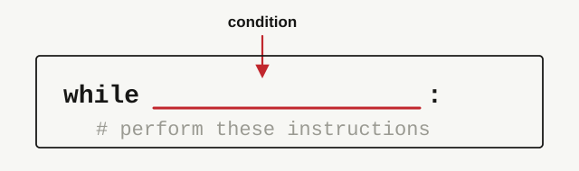

<h2 align=center>Lecture VI</h2>

<h1 align=center>Selection Statements: <code>elif</code>, and Intro to <code>while</code>-Loops</h1>

<h3 align=center>1er de Vendémiaire, de l'Année CCXXXV de la République</h3>

***Song of the day***: _[**Holocene**](https://youtu.be/TWcyIpul8OE) by Bon Iver (2011)._

---

### Sections

0. [**`elif`-Statements**](#part-0-elif-statements)
1. [**Common Mistakes**](#part-1-common-mistakes)
2. [**Shortcut ("Assignment") Operators**](#part-2-shortcut-assignment-operators)
3. [**Loops**](#part-3-loops)
4. [**`while`-Loops**](#part-4-while-loops)

### Part 0: _`elif`-Statements_

Last class, our `if`-`else` structure gave us a **binary** fork: if the condition is true we do one thing, otherwise we
do the other. But a lot of "choices" in programming and software development are not simply binary; they can include
three, four, or even thousands of different paths depending on the situation. For example, let's go back to our
age-check program. If the user enters a negative number, our site will of course not let them in. But what if we wanted
to tell them that the value they entered is invalid, instead of telling them that they are underage? It may seem like a
minor change, but it can make a world of difference to the people using your app.

In programming, we can achieve this multi-branching by using the "else if" statement, or the `elif`-statement in Python.

```python
CURRENT_YEAR = 2026
AMERICAN_DRINKING_AGE = 21

user_birth_year = int(input("What year were you born in? "))
difference = CURRENT_YEAR - user_birth_year

if user_birth_year < 0:
    print("Invalid input")
elif difference >= AMERICAN_DRINKING_AGE:
    print("Welcome!")
else:
    print("No entry for underage users.")
```

This, in English, would read as:

> If the value of `user_birth_year` is negative, print `"Invalid input"`. 
> 
> If the value of `difference` is greater than or equal to the value of `AMERICAN_DRINKING_AGE`, print `"Welcome!"`.
> 
> If neither of these conditions is true, then 
> print `"No entry for underage users."`.

Immediately we notice the biggest difference between `elif` and `else`: just like `if`-statements, `elif`-statements
**must take a condition**.

This is because you are telling Python to consider several sets of options. It will consider them all in order, and if
none of them evaluate to `True`, it will execute whatever instructions exist under the `else`-statement, if any.

The great thing about `elif`, too, is that you can have several of them in one `if`-`elif`-`else` block. What happens if
the user enters a year that is greater than 2026? The value of `difference` would then be negative:

```commandline
What year were you born in? 2030
No entry for underage users.
```

While this is...technically true, it still doesn't make much sense. A better way to implement this program would be
([**full program**](age_restrictions.py)):

```python
CURRENT_YEAR = 2026
AMERICAN_DRINKING_AGE = 21

user_birth_year = int(input("What year were you born in? "))
difference = CURRENT_YEAR - user_birth_year

if user_birth_year < 0:
    print("Invalid input")
elif difference < 0:
    print("No entry for unborn users.")
elif difference >= AMERICAN_DRINKING_AGE:
    print("Welcome!")
else:
    print("No entry for underage users.")
```
Output:
```commandline
What year were you born in? 2030
No entry for unborn users.
```

The same structure lets us finish last class's [**module practice problem**](quiz_one.py), now with a personalised
message for each case.

### Part 1: _Common Mistakes_

Two things happen rather often when first starting out with branching.

---

The first is the order of your `if`s and `elif`s. What would have happened if my age check code were instead implemented
this way:

```python
CURRENT_YEAR = 2026
AMERICAN_DRINKING_AGE = 21

user_birth_year = int(input("What year were you born in? "))
difference = CURRENT_YEAR - user_birth_year

if difference >= AMERICAN_DRINKING_AGE:
    print("Welcome!")
elif user_birth_year < 0:
    print("Invalid input")
elif difference < 0:
    print("No entry for unborn users.")
else:
    print("No entry for underage users.")
```

We are still checking for the same four different possibilities, right? The big problem here is that Python does **not**
check all four options at the same time. It checks them one-by-one, from top to bottom.

```commandline
What year were you born in? -40
Welcome!
```

That's clearly not right. What happened here is that Python first checked the `if`-statement condition, which only cares
about `difference` being at least `AMERICAN_DRINKING_AGE`. If we enter `-40` for our birth year, the value of 
`difference` would be `2066`. So, yeah, you can drink if you are 2066 years old, but that is not the point here. We have
a very specific set of instructions to execute in such case that the user enters a negative number.

In general, the broadest conditions should go first, and get more specific as you add more `elif`-statements.

---

The second thing that always comes up is the question:

> How do I know if I should use `elif`s or just several `if`-statements?

Let's replace all of our `elif`-statements from before and see what happens:

```python
CURRENT_YEAR = 2026
AMERICAN_DRINKING_AGE = 21

user_birth_year = int(input("What year were you born in? "))
difference = CURRENT_YEAR - user_birth_year

if difference >= AMERICAN_DRINKING_AGE:
    print("Welcome!")
if user_birth_year < 0:
    print("Invalid input")
if difference < 0:
    print("No entry for unborn users.")
else:
    print("No entry for underage users.")
```

- _Example #1_:
```commandline
What year were you born in? 1993
Welcome!
No entry for underage users.
```

- _Example #2_:
```commandline
What year were you born in? -1989
Welcome!
Invalid input
No entry for underage users.
```

What went wrong? The problem here is that **every time Python sees an `if`-statement, it will execute it**. In other 
words, using only `if`-statements is not like taking a single path of a series of options, but rather like taking several
single paths of only two options.

### Part 2: _Shortcut ("Assignment") Operators_

Here's a table of Python's shortcut operators and their long-form equivalents. I will pretty much be using them every
time the situation demands it, so just be aware of what they mean:

| **Operator** | **Shorthand** | **Expression** | **Description**                                                                  |
|--------------|---------------|----------------|----------------------------------------------------------------------------------|
| `+=`         | `x += y`      | `x = x + y`    | Adds 2 numbers and assigns the result to left operand.                           |
| `-=`         | `x -= y`      | `x = x - y`    | Subtracts 2 numbers and assigns the result to left operand.                      |
| `*=`         | `x *= y`      | `x = x * y`    | Multiplies 2 numbers and assigns the result to left operand.                     |
| `/=`         | `x /= y`      | `x = x / y`    | Divides 2 numbers and assigns the result to left operand.                        |
| `%=`         | `x %= y`      | `x = x % y`    | Computes the modulus of 2 numbers and assigns the result to left operand.        |
| `**=`        | `x **= y`     | `x = x ** y`   | Performs exponential (power) calculation and assigns the result to left operand. |
| `//=`        | `x //= y`     | `x = x // y`   | Performs floor division and assigns the result to left operand.                  |

<p align=center>
    <sub>
        <strong>Figure 1</strong>: Shortcut operators in Python (<a href="https://www.w3resource.com/python/python-operators.php#ass-op"><strong>source</strong></a>).
    </sub>
</p>

These are sometimes also called "assignment operators", since technically you are reassigning a value to the same 
variable based on its previous value. I prefer calling them shortcut operators, but it is something to keep in mind.

### Part 3: _Loops_

I've been really emphasising making sure that the user enters "the correct input" whenever we do problems in class. For
instance, say we wrote a short program asking the user if they would like to continue or not, like in a video 
game after you've lost all your lives:

```python
user_choice = input("Continue? [y/n] ")

if user_choice == 'y':
    print("Continuing...")
elif user_choice == 'n':
    print("Game over!")
```

You may be wondering about two things:

1. How do we make sure that the user enters one of the two options in our program (`'y'` and `'n'`) and
nothing else?
2. If the user _does_ input an invalid character, can we continue to ask them to enter characters until they enter the 
correct one?

The answer to the first question is simple: you can't. So long as it is human beings using your software, you cannot 
ever guarantee that they will perform the correct steps, every single time. This is why checking for correct input using
selection statements is so important, and why I always emphasise it.

What about the second question? Of course we can. Software since the beginning of 
user interfaces has asked users for input, and allowed them to re-enter it if they do not recognise it. In other 
words, **they continue to execute their user input mechanisms until the user enters a recognisable one**. Or, put 
another way:

> The program will run **while** the user enters the wrong input.

Similar to an `if`-statement, it will check if the input is valid. If it is not, it will repeat the instruction. If it is 
valid, the program will stop looping and continue onto the next line that is not part of the loop.

Something, maybe, that would look like this pseudo-code example:

```text
WHILE user_choice != 'y' AND user_choice != 'n'
    REPEAT user_choice = input("Continue? [y/n] ")
```

This happens all the time in computer science. An Instagram story is displayed **while** the twenty-four hour period is
not over. A video game character can continue fighting **while** their health is not 0.

So, how do we achieve this in Python? With our first loop of the semester, the `while`-loop.

### Part 4: _`while`-loops_

The general syntactical structure of a Python `while`-loop is as follows:

<a id="fg-2"></a>

<p align=center>
    
    </img>
</p>

<p align=center>
    <sub>
        <strong>Figure 2</strong>: Notice the indentation of the instructions—similar to an <code>if</code>-statement.
    </sub>
</p>

This, in English, would read as:

> **While** `condition` remains `True`, perform these instructions **indefinitely**.

To apply this syntax to our yes/no example from above, we would do the [**following**](game_over.py):

```python
user_choice = input("Continue? [y/n] ")

while user_choice != 'y' and user_choice != 'n':
    user_choice = input("Continue? [y/n] ")

if user_choice == 'y':
    print("Continuing...")
elif user_choice == 'n':
    print("Game over!")
```

In English, we would read this as:

> While `user_choice` does _not_ equal `'y'` and `user_choice` does _not_ equal `'n'`, execute the line `user_choice = 
> input("Continue? [y/n] ")` **indefinitely**.

In other words, as soon as `user_choice` equals `'y'` or `'n'`, the loop condition will be false, and we will exit the
loop completely.

Check out the following sample behaviour:

```text
Continue? [y/n] q
Continue? [y/n] c
Continue? [y/n] n
Game over!
```

If we read the code in order, from top to bottom, the steps would be:

1. We ask the user for the first input.
2. The user enters `'q'`.
3. The `while`-loop condition is evaluated. `user_choice` is not equal to `'y'` and is not equal to `'n'`.
4. The `while`-loop condition simplifies to `True`, so we enter the `while`-loop.
5. We ask the user for input again.
6. The user enters `'c'`. 
7. The `while`-loop condition is evaluated. `user_choice` is not equal to `'y'` and is not equal to `'n'`.
8. The `while`-loop condition simplifies to `True`, so we enter the `while`-loop again.
9. We ask the user for input again.
10. The user enters `'n'`.
11. The `while`-loop condition is evaluated. `user_choice` is not equal to `'y'`, but it is equal to `'n'`.
12. The `while`-loop condition simplifies to `False`, so we **do not** enter the `while`-loop again.
13. The `if`-statement condition is evaluated. `user_choice` is not equal to `'y'`, so the line indented under it is
**not** executed.
14. The `elif`-statement condition is evaluated. `user_choice` is equal to `'n'`, so the line indented under it is
executed.
15. The string `"Game over!"` is printed.
16. The program ends.

---

`while`-loops can also be used in numerical contexts. For example, if we were programming a video game where the user
gains a new life after collecting 100 coins, we could do something like [**this**](new_life.py):

```python
import random

NEW_LIFE_COINS = 100

coin_amount = 0
life_amount = 1

print("STARTING LIVES:", life_amount)
print("STARTING COINS:", coin_amount)

while coin_amount < NEW_LIFE_COINS:
    random_coin_amount = random.randrange(1, 21)  # let's say the user can only gain a max of 20 coins per turn
    coin_amount += random_coin_amount
    print("GAINED COINS: " + str(random_coin_amount) + ". CURRENT COINS: " + str(coin_amount))

life_amount += 1

print("ENDING LIVES:", life_amount)
print("ENDING COINS:", coin_amount)

```

Potential output:

```commandline
STARTING LIVES: 1
STARTING COINS: 0
GAINED COINS: 7. CURRENT COINS: 7
GAINED COINS: 19. CURRENT COINS: 26
GAINED COINS: 15. CURRENT COINS: 41
GAINED COINS: 17. CURRENT COINS: 58
GAINED COINS: 12. CURRENT COINS: 70
GAINED COINS: 4. CURRENT COINS: 74
GAINED COINS: 6. CURRENT COINS: 80
GAINED COINS: 18. CURRENT COINS: 98
GAINED COINS: 7. CURRENT COINS: 105
ENDING LIVES: 2
ENDING COINS: 105
```

In other words, once the `while`-loop starts, the condition `coin_amount < NEW_LIFE_COINS` will be evaluated. As long as
it evaluates to `True` (i.e. as long as `coin_amount` is less than `NEW_LIFE_COINS`), a random number of coins between 1
and 20 will be generated and added to `coin_amount`. At some point, `coin_amount` will _not_ be less than 
`NEW_LIFE_COINS`, and we will exit the `while`-loop completely.

---

You may have noticed this already, but `while`-loops are primarily used in situations where **the programmer doesn't
necessarily know when the loop is going to stop**. We don't know when the user will decide to enter either `'y'` or 
`'n'`. We don't know how many random generated numbers it will take for our coin amount to go over 100. In this way,
our program may never end. This would not be our fault—we are giving the user instructions, and they can choose to never
enter the correct input.

There is, however, one very dangerous situation where a `while`-loop would never end, and it would be our fault. This is
what is called an **infinite loop**. Take a look at the following example:

```python
LIMIT = 10

counter = 0

while counter <= LIMIT:
    user_input = float(input("Enter a number to add to our counter: "))

print("The final value of our counter is:", counter)
```

If we tried to run this program, we would never exit the `while`-loop. Ever. Why? Because while we are asking the user
to enter a value to add to `counter`, we never actually **add it** to `counter`. This mistake is super super super easy
to make. It happens to *me* all the time. To fix it, all we have to do is:

```python
LIMIT = 10

counter = 0

while counter <= LIMIT:
    user_input = float(input("Enter a number to add to our counter: "))
    counter += user_input

print("The final value of our counter is:", counter)
```

---

Oh and, before anybody asks, the use of the `break` keyword is ***absolutely forbidden*** in this class. The situations
where it is absolutely necessary are so few and far between that if you find yourself needing it in this class, you are
doing something wrong.

---

<sub>**Previous: [Selection Statements: `if` and `else`](/lectures/05-selection-statements)** || **Next: [Control-Flow Structures: The `for`-Loop](/lectures/07-for-loop)**</sub>
